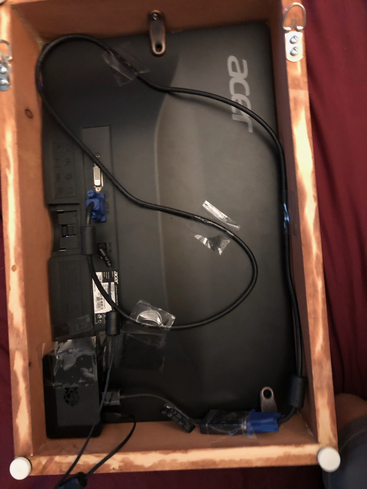

# SmartMirror

This is a smart mirror I created that displays helpful information such as the date, time, my game stats, etc. I get this information by using APIs for weather, alerts, and game stats. The APIs are from APIXU and Steam API services. When creating the code, I looked at Hacker Shack's smart mirror code as a reference. You can view that code [here](https://github.com/HackerShackOfficial/Smart-Mirror). I built the code and the frame during the summer and it currently hangs in my room. The program runs on a Raspberry Pi 3 Model B. For the display, I used an old Acer monitor.

You can get a steam API key [here](https://steamcommunity.com/dev/apikey).

You can get an APIXU key by creating an account and registering for one [here](https://www.apixu.com/signup.aspx).

The front of the acrylic sheet acts as a mirror and it allows light to pass through so I can have words appear "on the screen."

This is the front of the mirror.

This is the back of the mirror. I taped the HDMI cable to keep it from protruding out.and used corner brackets to keep the monitor and acrylic sheet in place.

